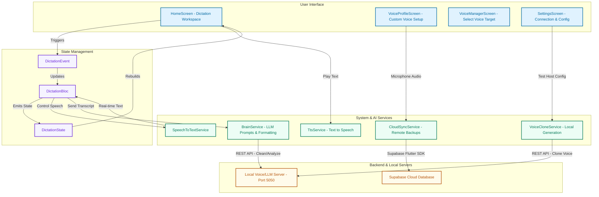

# 🏗️ OmniScribe AI Architecture Diagram

This document illustrates the architecture and data flow of the OmniScribe AI application.

---

## 🔁 Key Data Flows

### 1. Multilingual Speech-to-Text (STT)
1. User taps the **Microphone Button** on `HomeScreen`.
2. `HomeScreen` runs a system permission check (checks microphone/speech permissions).
3. If permissions are granted, `StartDictation` event is sent to `DictationBloc`.
4. `DictationBloc` calls `SpeechToTextService` to initialize the device microphone.
5. Voice input is processed real-time, sending words back to `DictationBloc` which updates `DictationState.transcript`.
6. UI listens to `DictationState` and displays the text live.

### 2. Domain-Aware AI Cleanups
1. When recording stops, `DictationBloc` fires `CleanTranscription` and `GenerateInsights`.
2. `DictationBloc` calls `BrainService.cleanTranscript(text)` and `BrainService.analyzeTranscript(text, domainPrompt)`.
3. `BrainService` executes HTTP requests to the **Local AI Server** (running llama.cpp / custom server on Port 5050).
4. The server returns formatted output (e.g. Legal, Academic, or Spiritual structure) and dynamic suggestions.
5. The UI updates text editor content and displays suggestions inside the **AI Insights Sheet**.

### 3. Voice Profile Creation & Cloud Sync
1. User opens `VoiceProfileScreen` and records standard validation text.
2. The audio is saved locally as a `.wav` file using `path_provider`.
3. If **Supabase** is configured, `CloudSyncService` uploads the audio file to the remote bucket `voice_profiles` and creates a document entry in the database.
4. If **Supabase** is not configured (offline mode), the app displays a warning card, and files are stored only on the local disk.
